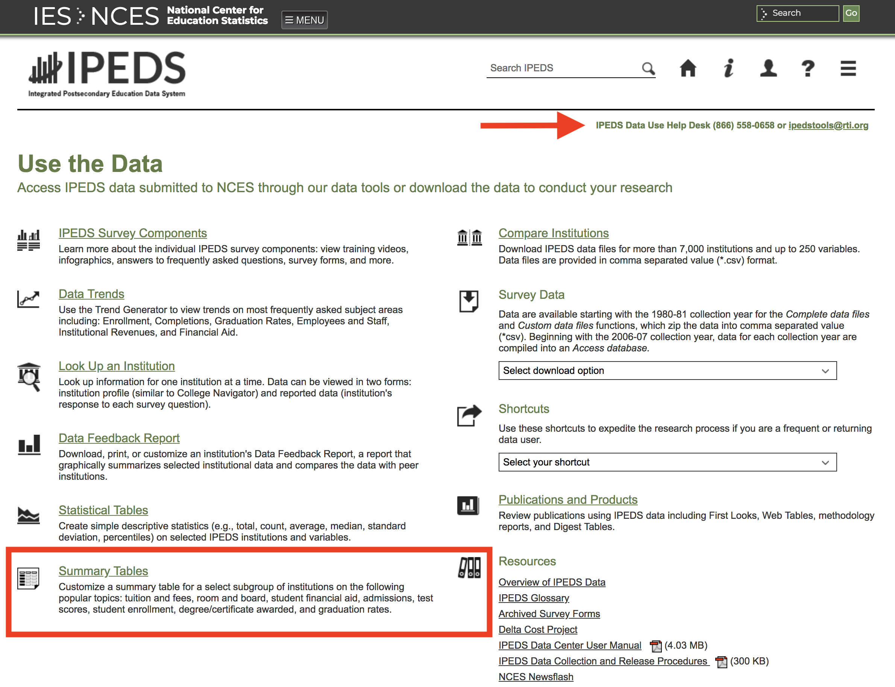
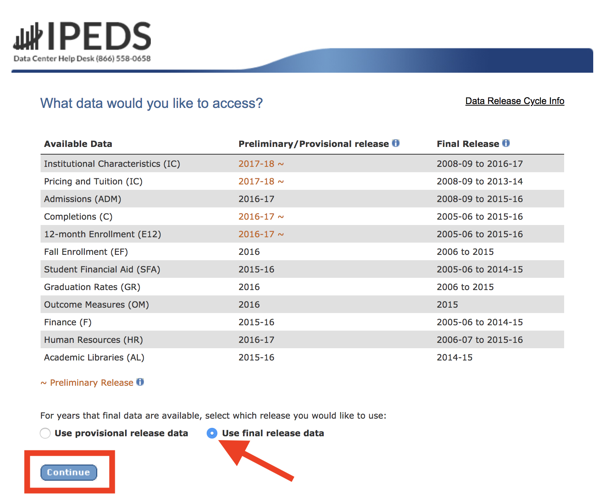
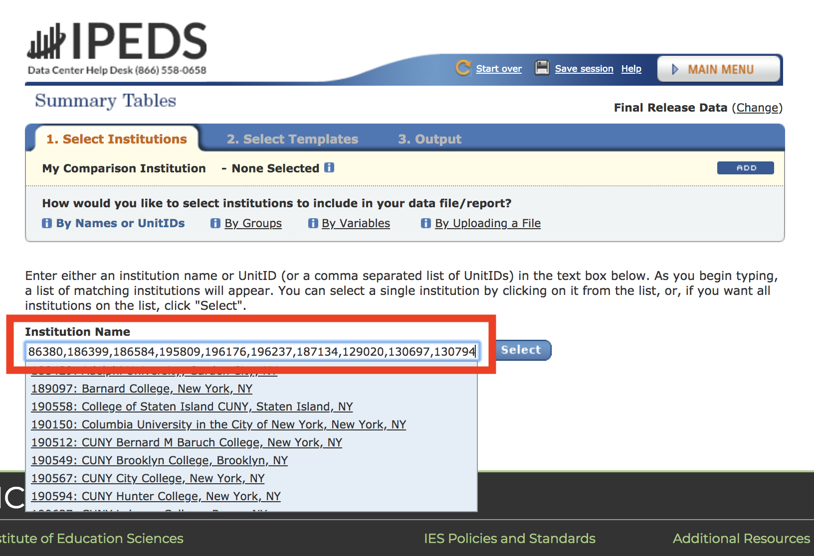
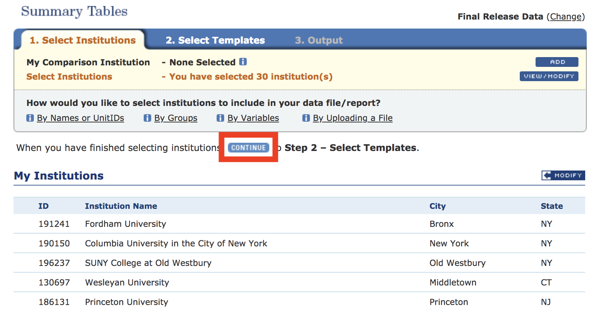
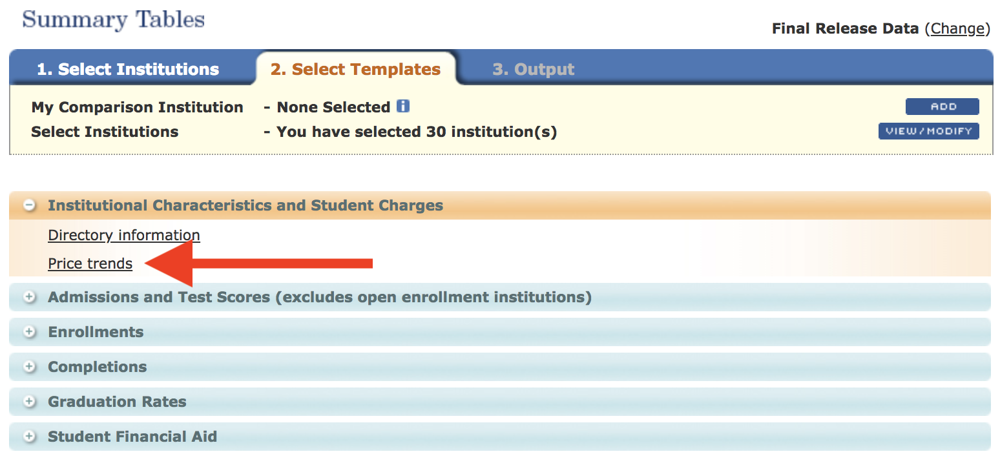
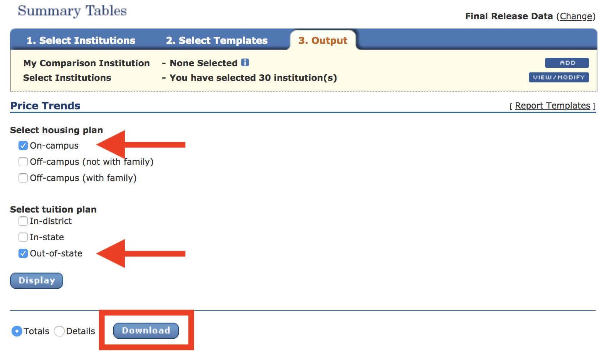

# Get tuition data for area schools

1. Visit the IPEDS website at __[nces.ed.gov/ipeds/use-the-data](https://nces.ed.gov/ipeds/use-the-data).__
2. Make note of the contact info for the agency's Help Desk. Then click the __Summary Tables__ item.  

3. Choose the option to __Use final release data__, then click the __Continue__ button.  

4. Select institutions by name or by comma-separated Unit ID codes (don't select a comparison institution). For instance, use the __Institution Name__ live search field to enter the following ID numbers for 30 major four-year schools in the Tri-State region:
`188429,189097,190150,190512,190549,190567,190594,190637,190646,190664,190558,190691,191241,191649,192439,192448,193900,194310,186131,130226,186380,186399,186584,195809,196176,196237,187134,129020,130697,130794`  

5. Click the __Check All__ option to select all institutions, then click the __Continue__ button.
6. Look over the list and click the __Continue__ button to move to the "Select Templates" options.  

7. Expand the __Institutional Characteristics and Student Charges__ section, then choose __Price trends__.  

8. Under Housing plan, choose only the __On-campus__ checkbox and under Tuition plan, choose only the __Out-of-state__ checkbox. Also, select the __Totals__ radio to tk and select the __Details__ radio to tk, then click the __Downloads__ button.  

9. After the browser downloads the `.xls` file, find it in the Downloads folder and open it in Excel.
10. tk
